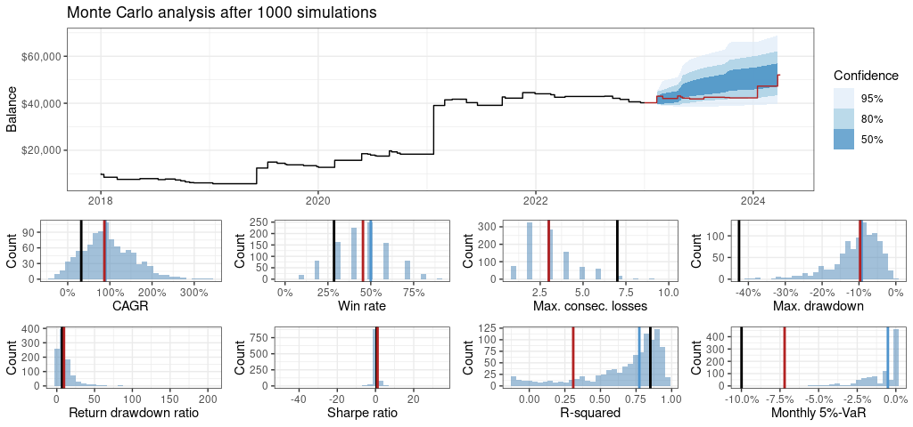

<!-- README.md is generated from README.Rmd. Please edit that file -->

# traderlab

<!-- badges: start -->

[](https://lifecycle.r-lib.org/articles/stages.html#experimental)
[](https://github.com/jmartindelasierra/traderlab)
<a href="https://www.buymeacoffee.com/jmartindelasierra" target="_blank"></a>
<!-- badges: end -->


## Disclaimer

It is important to note that trading in financial markets involves
inherent risks, including the potential loss of capital. The results
presented within this package may not be suitable for all investors, and
past performance is not indicative of future results.

Users are solely responsible for evaluating the suitability of any
trading strategy for their own individual circumstances and risk
tolerance. The author of this software shall not be held liable for any
losses, damages, or other consequences arising from the use or
application of the results presented herein in real trading
environments.

Before engaging in any trading activity, users are strongly advised to
consult with a qualified financial advisor and to thoroughly understand
the risks involved. By using this software, users acknowledge and accept
that they do so at their own risk, and the author shall not be held
responsible for any outcomes resulting from its use.

## What is traderlab?

traderlab is a package for fast trading strategies design, backtesting
and quantitative analysis with practical applications. It allows the
creation of strategies by the composition of a YAML file where data,
indicators, rules and money management, among other information required
for the backtesting engine, are specified. Simple commands run the YAML
file, show the results and plot them.

This current version has a series of limitations since it has been
developed for a specific need and might not be suitable for other uses.
Here are the most important ones:

-   Only Binance and Yahoo data download is implemented so far. Other
    sources and datasets are technically possible as long as they
    contain OHLCV data and this is provided in the expected format.

-   Strategy rules are evaluated at the close of the last bar.

-   The user can only indicate an out-of-sample period by defining its
    start date. Then the period will cover from the specified date until
    last available time in the dataset.

-   Each model execution overwrites the results from previous runs. The
    reason behind this is that a large number of worthless backtests and
    metrics are usually generated, taking up a lot of space and making
    it very difficult to explore later. In the future, the user will be
    able to store the results in a more permanent database, allowing
    more advanced features.

## What is not traderlab?

traderlab is not a package for typical financial analysis and there is
not a intention to substitute them. Instead, traderlab is focused on
trading markets by means of technical indicators and pursuing a
practical approach.

The package does not find for the user profitable strategies neither.
The user must provide the indicators and trading rules and he/she is the
responsible of evaluating whether or not the strategy is suitable for
him/her.

In the current version, traderlab **does not execute real trading** in
any case. As its name suggests, it is intended to be a trading
strategies laboratory to test and analyze them.

## How does traderlab work?

While other packages in R, Python and other languages require from a
moderate to an intensive coding to specify and test a trading strategy,
traderlab makes this task easy for the user.

A YAML file (basically a text file) is almost everything a user has to
worry about. This file contains what we call a model.

A model is nothing but indicators and rules with variables involved, and
additional information. Part of this information specifies the range of
values that the variables can take, a preliminary target metric, an
out-of-sample period, etc.

The target metric does not exclude other important metrics. All of them
will be available after the backtesting, but the target is useful as it
informs to the user about the performance without waiting to the end as
long as the previewer is set to true.

## Installation

Install the current development version of traderlab as follows:

``` r
install.packages("devtools")
devtools::install_github("jmartindelasierra/traderlab")
```

In the DESCRIPTION file you can see that traderlab has many
dependencies. If your installation fails and you get lost in the output
messages, then be patient and install the dependencies one by one so you
can focus on the failing dependency.

## Data download

### Binance

Binance data can be downloaded with the `get_binance_ohlcv_data()`
function.

This function downloads all the available files in the Binance
repository and consolidates them in a single dataset. Finally, it is
saved in `./datasets` from your working folder.

The following example downloads the 4-hour history for Bitcoin/USDT:

``` r
get_binance_ohlcv_data(symbol = "BTCUSDT", timeframe = "4h")
```

After the download, the file `btcusdt_4h.rds` will be available in
`./datasets`.

### Yahoo

You can also download other data for different assets with the
`get_yahoo_ohlcv_data()` function.

The data from this source will be limited to daily OHLCV. In addition,
you may get data with missing values, which are replaced (not very
accurately) with the previous non-missing value.

The following examples download data for SP500, Tesla, and EUR/USD:

``` r
get_yahoo_ohlcv_data(symbol = "SPY")
get_yahoo_ohlcv_data(symbol = "TSLA")
get_yahoo_ohlcv_data(symbol = "EUR=X")
```

The datasets are then saved as `spy_1d.rds`, `tsla_1d.rds` and
`eur=x_1d.rds` in `./datasets`.

### Using data from other sources

Despite not providing functions for downloading data from different
sources than Binance and Yahoo, there is not technical inconvenient to
use other sources.

As you have probably guessed, traderlab works with `open`, `high`, `low`
and `close` prices, and `volume` data. Two additional features are also
required: `open_time` and `close_time`. So, if you want to use other
datasets, ensure you can provide to traderlab a `data.frame` in `.rds`
format with the following columns:

| column     | class   |
|:-----------|:--------|
| open_time  | POSIXct |
| open       | numeric |
| high       | numeric |
| low        | numeric |
| close      | numeric |
| volume     | numeric |
| close_time | POSIXct |

**Note: do not use any of the previous column names for naming your
indicators or variables to avoid collisions and unexpected behavior.**

## Model anatomy

Remember that a model is a YAML file containing the indicators setup,
strategy rules, money management and other information for the backtest
engine. This concept allows the user create and test strategies avoiding
to code them as required in many other solutions.

We made an effort to design a YAML structure as simple as possible
resulting in a set of lists of key-values as we will show soon.

The following sections (lists) must exist in a model:

``` yaml
description:
indicators:
rules:
management:
periods:
target:
steps:
```

Let’s look at each one in detail.

### Description

Here is where we annotate descriptive information about the model
including the data source path:

``` yaml
description:
  name:
  symbol:
  timeframe:
  data:
```

`data` is the only mandatory key and a path to the data source is
expected here (e.g. ./datasets/btcusdt_4h.rds). However, we recommend to
add values to the other keys as this helps to keep organized your work
by giving the model a `name` and specifying the `symbol` and
`timeframe`.

**Note: strings do not need to be quoted as formats are automatically
detected. This applies to the entire YAML file.**

### Indicators

This section must have the following structure:

``` yaml
indicators:
  name1:
    indicator:
    parameter1:
    parameter2:
  name2:
    indicator:
    parameter1:
  ...
```

Here, `indicators` announces the indicators section start. Each
indicator must be identified by an unique `name` of your choice that
will be used for referencing later. The `indicator` key is used to call
a listed indicator (see the accepted indicators list) and the following
`parameter` keys are used to setup such indicator.

### Rules

The rules section is declared as follows:

``` yaml
rules:
  entry_signal:
  exit_signal:
  stop_loss_price:
```

`entry_signal` and `exit_signal` must contain the logical expressions
that indicate whether a trade entry or exit takes place (e.g. close \>
ema). These two signals are necessary to run a model.

`stop_loss_price` must contain a expression which evaluation returns a
stop loss price (e.g. entry_price - 100). Stop loss is not mandatory.

### Management

Here is how you tell the engine about managing the capital:

``` yaml
management:
  position:
  start_capital:
  interest_type:
  reinvest:
  leverage:
  fee_type:
  fee:
```

`position` can be long or short.

The `reinvest` must be provided in a percentage between 0 and 1. If
`interest_type` is simple, the `reinvest` is recomputed as
`reinvest * start_capital`, reinvesting a fixed capital per trade. If
`interest_type` is compound, each trade will have available the
percentage portion of the current capital.

`fee_type` concerns to a fixed amount or a percentage per trade. If it
is configured as `per_trade_fixed`, `fee` will be provided in dollars.
If on the other hand is configured as `per_trade_pct`, `fee` must be
provided in a percentage between 0 and 1.

### Periods

This section allows us cropping the dataset by defining a `start` and/or
an `end` date. In addition, `oos_start` is used to indicate the
out-of-sample start period. We can only indicate the start as
automatically the last bar in the dataset becomes the out-of-sample end:

``` yaml
periods:
  start:
  end:
  oos_start:
```

### Target

The target is intended for preliminary evaluation of the model. This is
especially useful if `preview` is set to TRUE in the run model call. You
must specify a `metric` to evaluate, set the `operation` type whether
you look to maximize or minimize the metric, and the `scope` where it is
evaluated (in-sample, out-of-sample or full-sample):

``` yaml
target:
  metric:
  operation:
  scope:
```

### Steps

Some keys allow the use of variables given in the format
`$variable_name`. Their values are evaluated according to the specified
in this section:

``` yaml
steps:
  variable_1:
  variable_2:
  variable_n:
```

## Running the model

Once the YAML file is completed and saved, running the backtests is as
simple as writing a single line:

``` r
library(traderlab)
run <- run_model("my_model.yaml", preview = TRUE)
```

If you save your model in a subfolder, ensure you specify the path
(e.g. “./models/my_model.yaml”).

There are different functions we can use to analyze and extract insights
from the resulting data. We find more suitable to briefly present these
functions in the following example.

## Example

Here we want to illustrate the analysis capabilities that this package
offers. In the next example we will see how to implement a basic moving
average crossover strategy as well as the steps to run the model and
analyzing its results.

### The model file

The following YAML represents a simple two-EMA crossover strategy for
Bitcoin at 4-hour bars data:

``` yaml
version: 1

description:
  name: Basic EMA crossover
  symbol: BTCUSDT
  timeframe: 4h
  data: ./datasets/btcusdt_4h.rds

indicators:
  ema1:
    indicator: EMA
    source: close
    periods: $ema1_periods
  ema2:
    indicator: EMA
    source: close
    periods: $ema2_periods

rules:
  entry_signal: ema1 > ema2
  exit_signal: ema1 < ema2
  stop_loss_price: entry_price - 0.1 * entry_price

management:
  position: long
  start_capital: 10000
  interest_type: simple
  reinvest: 1
  leverage: 1
  fee_type: per_trade_pct
  fee: 0.002

periods:
  start: 2018-01-01
  end:
  oos_start: 2023-01-01

target:
  metric: return_dd
  operation: max
  scope: is

steps:
  ema1_periods: [40, 50, 5]
  ema2_periods: [90, 100, 5]
  
```

**Note: if you work with a Unix based system, you might require a
newline at the end of your document to avoid an error.**

Let’s comment the setup:

The `version` is not mandatory so far. We are just annotating this for
future developments.

The `description` section indicates that this model is using a 4-hour
Bitcoin dataset.

Two `indicators` are setup. They are two EMAs evaluated at the close for
each bar. The periods are not fixed but referenced to two custom
variables: `$ema1_periods` and `$ema2_periods`.

The `rules` meet a typical two-EMA crossover strategy. The
`entry_signal` will be TRUE when `ema1` crosses above `ema2`. The
`exit_signal` will be TRUE when `ema1` crosses below `ema2`. A stop loss
has also been setup such that the trades will close when the price is a
10% below the entry price. All three rules refer at the bar close.

Concerning the `management` setup, when the entry signal happens, a long
position is open. The `start_capital` is \$10000 and because of the
simple `interest_type`, a fixed amount of capital (as maximum) of 100%
\* \$10000 = \$10000 will be available per trade. There is no `leverage`
(1x) and finally, the `fee_type` is configured as a % per trade which is
fixed to 0.2% in the `fee` key.

The object `periods` specifies that the dataset starts on 2018-01-01 and
the out-of-sample period does on 2023-01-01. The out-of-sample period
ends at the last bar of the dataset always.

The section `target` indicates the `metric` goal to monitor in the
backtesting process. We want to evaluate the `max` (maximum) `return_dd`
(return / drawdown) on `is` (in-sample period). This target does not
exclude the calculation of other metrics.

In `steps`, we assign values to the two custom variables defined before.
We want `ema1_periods` to go from 40 to 50 in increments of 5 (i.e. 40,
45, 50). `ema2_periods` will go from 90 to 100 in increments of 5
(i.e. 90, 95, 100). Note that here, the ‘\$’ symbol does not appear
anymore.

### First checks

One of the things we would like to know before running the model is the
number of steps it will take as well as the variable values in each
step. In the context of this package, a step can be understand as a
single backtest, so our model will run 9 backtests:

``` r
get_model_steps("./models/basic_ema_xover.yml")
```

``` r
$n_steps
[1] 9

$steps
  $ema1_periods $ema2_periods
1            40            90
2            45            90
3            50            90
4            40            95
5            45            95
6            50            95
7            40           100
8            45           100
9            50           100
```

We might also want to see how the indicators look like for some specific
step. Plotting the indicators is very useful to verify that they are
configured as expected and our strategy setup makes sense. This feature
still needs some improvements, but for the moment we can do like this:

``` r
library(ggplot2)

plot_trades(model = "./models/basic_ema_xover.yml",
            step = 1,
            from = "2024-01-01",
            to = "2024-03-31",
            show_trades = FALSE) +
    geom_line(aes(x = close_time, y = ema1), color = "steelblue3") +
    geom_line(aes(x = close_time, y = ema2), color = "orange3")
```


Or perhaps we are more interested in how the strategy signals occur. In
this case, our code do not need the traces associated to the indicators:

``` r
plot_trades(model = "./models/basic_ema_xover.yml",
            step = 1,
            from = "2023-01-01",
            to = "2024-03-31",
            show_trades = TRUE)
```


Of course, we can combine signals and indicators in the same plot by
switching back `show_trades` to TRUE and keeping the lines.

We also have the choice of getting a dataframe of this pre-process with
the help of our `set_indicators()` function:

``` r
s1 <- set_indicators("./models/basic_ema_xover.yml", step = 1)
```

`set_indicators()` returns the OHLCV data from the model decorated with
the indicator outputs, entry/exit signals, stop loss level, etc.,
**before fees**. This is especially helpful for a first exploratory
analysis of our trading idea and for plotting other features in the
dataset:

``` r
ggplot(s1 |> dplyr::filter(open_time >= "2024-01-01",
                           close_time <= "2024-03-31"),
       aes(x = close_time)) +
  geom_line(aes(y = volume)) +
  theme_bw() +
  labs(x = NULL, y = "Volume")
```


### The backtest

In this section, we perform an actual backtesting with the `run_model()`
function:

``` r
run <- run_model("./models/basic_ema_xover.yml", preview = TRUE)
```

By previewing the results, we will see a plot like in the image below.
The upper half is the area for the current step and the lower one
applies for the best step found so far (according to the target defined
in the model).

Two plots are shown by row. The left one is the balance (the cumulative
results + the capital) and the right one is the percentage return per
year. Giving these two plots we can have a good idea about the
performance before a deeper analysis.

**Note: an issue is known for the previewing feature. If the plot pane
(in RStudio) has not enough area to fit the plots, a series of warnings
related to graphics state are expected. This does not have an effect on
the execution nor the stored data.**


With the previous variable assignment, `run` will keep a structure with
some data that we can reuse later:

-   **data**: string with the path to the dataset.
-   **model**: string with the path to the YAML file.
-   **target**: dataframe with the target function and scope.
-   **step**: the step from set of steps that the target is met.
-   **variables**: dataframe with the variable values at such step.
-   **metrics**: dataframe comparing the metrics per scope at such step.

We also have the choice of making no variable assignment by simply
running `run_model("./models/basic_ema_xover.yml")`, but our
recommendation is to make a variable assignment to keep reference
values.

### Exploratory analysis

After running the model, we can obtain very general information in terms
of timings and signals for a first contact with the results:

The following code computes the timings from the stored balances:

``` r
balances() |>
    timings()
```

The output shows information about the total time covered by the dataset
and the time per scope. In the example, the total duration of the
dataset is about 6 years and 3 months. The in-sample period has a
duration of 5 years and represents almost an 80% of the data. The
out-of-sample period has a duration of 1 year and 3 months, and
represents a 20% of the data:

``` r
$total_time
                start                 end            duration
1 2018-01-01 04:59:59 2024-04-01 01:59:59 6y 3m -1d 21H 0M 0S

$scope_time
  scope               start                 end            duration  bars         p
1    is 2018-01-01 04:59:59 2023-01-01 00:59:59 5y 0m -1d 20H 0M 0S 10940 0.7999415
2   oos 2023-01-01 04:59:59 2024-04-01 01:59:59 1y 3m -1d 21H 0M 0S  2736 0.2000585
```

The next commands shows information about the signals. The `signals()`
function requires the number of step this time. The variable assignment
from the `run_model()` is useful here. Since we are interested in the
best step from the backtesting execution, we will get it by simply
calling `run$step`:

``` r
balances() |>
  signals(run$step)
```

Specifically, this step has 61 total entries and 60 exits (the last
trade is not closed in the chosen period). We also obtain the number of
entries/exits per scope, as well as its proportion (82% for in-sample,
18% for out-of-sample). Other information such exposure (52% in this
example) and average trade duration (2.7 weeks) are available:

``` r
$total_entries
[1] 61

$total_exits
[1] 60

$scope
  scope entries exits p_entries   p_exits
1    is      49    49 0.8032787 0.8166667
2   oos      12    11 0.1967213 0.1833333

$exposure
   bars trading p_trading
1 13676    7209 0.5271278

$avg_bars
[1] 114.9893

$avg_duration
[1] "1655845.43828265s (~2.74 weeks)"
```

If we move to a more performance related results, the most immediate
action is to read the data kept in the `run` variable. By simply typing
`run`, an interesting summary is returned. Now we are interested in the
metrics report and the values of the variables at this step:

``` r
$variables
      variable value
1 ema1_periods    45
2 ema2_periods    95

$metrics
              metric           is           oos         full
1             trades  49.00000000   11.00000000  60.00000000
2         pct_return   3.02195212    1.18380896   4.20576108
3               cagr   0.32098662    0.86968194   0.30217963
4           win_rate   0.28571429    0.45454545   0.31666667
5      profit_factor   2.74150157    5.81593220   3.12297708
6           wl_ratio   0.40000000    0.83333333   0.46341463
7           rr_ratio   3.53155523    2.87923985   3.36847639
8           avg_bars 109.02040816  150.50000000 117.18032787
9           exposure   0.49277879    0.66447368   0.52712782
10        expectancy 616.72492249 1076.18996173 700.96017968
11   max_consec_wins   3.00000000    2.00000000   3.00000000
12 max_consec_losses   7.00000000    3.00000000   7.00000000
13   risk_adj_return   6.13247193    1.78157388   7.97863622
14            pct_dd  -0.42532318   -0.09689864  -0.42532318
15         return_dd   7.02247107    9.48943890   9.77342933
16           cagr_dd   0.75468876    8.97517206   0.71047063
17      sharpe_ratio   0.57773545    1.07703944   0.52590032
18         r_squared   0.85038789    0.30889049   0.86246072
19           k_ratio   0.33771018    0.21260849   0.32100899
20               sqn   1.41034537    1.70042654   1.82885513
21               var  -0.09991205   -0.07203091  -0.07103929
22              cvar  -0.11305337   -0.07327635  -0.10748702
```

There are other functions that allow exploring the balances, variables
and metrics obtained from the model execution. If we are not satisfied
with the results for the target metrics, we can explore other metrics.

In the following example we filter the dataset returned by `metrics()`.
We are interested in the in-sample period and only the steps that meet a
return / drawdown greater than 5. We reshape the result and sort in
descending mode by Sharpe ratio. If we printed at this point, we would
see that the best step is the number 6, so the next function filters by
6 and finally we print the scope comparison:

``` r
metrics() |>
    filter_is() |>
    filter_metrics(return_dd > 5) |>
    pivot_metrics() |>
    sort_metrics(-sharpe_ratio) |>
    filter_step(6) |>
    compare_scopes() |>
    print(n = 25)
```

If this resulted in better metrics for us, we could get the variable
configuration as follows:

``` r
variables() |>
    filter_step(6)
```

There is much more to explore with the functions provided by the
package, but going deeper in this aspect is not the purpose of this
example nor document.

### Performance plots

Printing metrics is essential as it is the way of analyzing our strategy
with numbers, but making visuals of the performance is also necessary.

#### Balance and drawdown

The first plot one can expect is the balance as shown in the previewing.
The `plot_balance()` function offers this and adds drawdown subplots:

``` r
plot_balance(step = run$step)
```


The out-of-sample period is shadowed and two drawdown subplots are
shown. We are usually interested in percentage terms, but in this plot
we have available the drawdown in monetary terms as well. This double
representation of loss helps us to understand the risk of the strategy
and allows us keeping focus on the money we would lose.

#### Returns

Once known the balance curve and drawdown, we might be curious about the
individual returns, their distribution and how they accumulate in
monthly and annual terms. This information is given by the
`plot_returns()` function:

``` r
plot_returns(step = run$step)
```


#### Durations

An strategy performance must also consider timing aspects as the
duration of the trades. This is just what `plot_durations()` gives us:

``` r
plot_durations(step = run$step)
```


The durations are given in number of bars so we must multiply by the
timeframe if we want them in terms of time.

#### Benchmark

Making profitable strategies with low drawdowns is our target, but at
the end of the day, our strategies must also beat certain benchmarks.
One simple benchmark is the buy and hold strategy and what we must
question is if our trading strategy is better than that, meaning that
our effort to design and analyze strategies makes sense. The
`plot_benchmark()` function shows us a comparison:

``` r
plot_benchmark(step = run$step)
```


The two strategies are compared in the same plot as they are represented
in percentage terms. Additional information is useful here like the
portion of time that the trading strategy is above the buy and hold
strategy, the correlation of both series and the correlation in annual
return terms.

#### Excursions

An interesting and important trading performance study is the analysis
of the excursions per trade so we can basically see what loss assume
each winning and losing trade. We can access this information with the
`plot_excursions()` function, which returns a compound plot with
different information about the % price excursions from the entry price:

``` r
plot_excursions(step = run$step)
```


#### Robustness

traderlab offers a robustness test based on Monte Carlo simulations with
the `plot_monte_carlo()` function. This function allows different
configurations that helps us to determine if our strategy is robust
enough:

``` r
plot_monte_carlo(step = run$step, scope = "oos", samples = 1000)
```



For a series of relevant performance metrics, the values for in-sample
and out-of-sample are compared. The metrics distribution as a result of
the Monte Carlo simulations and its average are also shown. In addition,
in the console are printed the simulated values for different confidence
intervals.

Giving a training about this test and plot is out of the scope of this
document.

## List of indicators

This is the list of available indicators and their required parameters:

### Absolute Range (AR)

-   Output: high - low

Example:

``` yaml
indicators:
  ar:
    indicator: AR
```


### Aroon

-   Parameter:
    -   **periods**
-   Outputs:
    -   **up**
    -   **dn**
    -   **osc**: up - dn
-   Range:
    -   **up**: \[0, 100\]
    -   **dn**: \[0, 100\]
    -   **osc**: \[-100, 100\]

Example:

``` yaml
indicators:
  aroon:
    indicator: Aroon
    periods: 6
```


### Average Directional Movement Index (ADX)

-   Parameter:
    -   **periods**
-   Outputs:
    -   **dip**: positive direction index
    -   **din**: negative direction index
    -   **dx**: direction index
    -   **adx**: average direction index (trend strength)
-   Range: \[0, 100\]

Example:

``` yaml
indicators:
  adx:
    indicator: ADX
    periods: 20
```


### Average True Range (ATR)

-   Parameter:
    -   **periods**: number of bars to average.
-   Output: mean(TR)

Example:

``` yaml
indicators:
  atr:
    indicator: ATR
    periods: 10
```


### Bollinger bands

-   Parameters:
    -   **periods**
    -   **sd**
-   Outputs:
    -   **upr** = SMA + SD \* 2
    -   **avg** = SMA
    -   **lwr** = SMA - SD \* 2
    -   **pct** = (close - lwr) / (upr - lwr)

Example:

``` yaml
indicators:
  bol:
    indicator: Bollinger
    periods: 10
    sd: 2
```


### Custom indicator

-   Parameter:
    -   **expression**: custom logic

Example:

``` yaml
indicators:
  hl_avg:
    indicator: custom_indicator
    expression: (high + low) / 2
```


### Day of the month

-   Parameters:
    -   **source**: open_time or close_time

Example:

``` yaml
indicators:
  mday:
    indicator: day_of_month
    source: close_time
```

### Day of the week

-   Parameters:
    -   **source**: open_time or close_time

Example:

``` yaml
indicators:
  wday:
    indicator: day_of_week
    source: close_time
```

### Days to month end

-   Parameter:
    -   **source**: open_time or close_time
-   Output: days in current month - current day

Example:

``` yaml
indicators:
  dtme:
    indicator: days_to_month_end
    source: close_time
```

### Daily value

-   Parameter:
    -   **source**: open, high or low
-   Output: current day open, high or low

Example:

``` yaml
indicators:
  daily_high:
    indicator: daily_value
    source: high
```


### Donchian channels

-   Parameter:
    -   **periods**
-   Outputs:
    -   **upr**
    -   **avg**
    -   **lwr**

Example:

``` yaml
indicators:
  dch:
    indicator: Donchian
    periods: 10
```


### Down in a row

-   Parameter:
    -   **source**
    -   **periods**

Example:

``` yaml
indicators:
  dir:
    indicator: down_in_row
    source: close
    periods: 3
```

### Exponential Moving Average (EMA)

-   Parameters:
    -   **source**: open, high, low or close
    -   **periods**: number of bars to average

Example:

``` yaml
indicators:
  ema:
    indicator: EMA
    source: close
    periods: 20
```


### Gaussian noise

**This is not an indicator, but it is formulated and applied on the
OHLCV data in the same way**

-   Parameters:
    -   **source**
    -   **pct_dev**: deviation from the source value in %

Example:

``` yaml
indicators:
  noisy_close:
    indicator: noise
    source: close
    pct_dev: 0.005
```

### Highest value

-   Parameters:
    -   **source**: open, high, low or close
    -   **periods**

Example:

``` yaml
indicators:
  highest:
    indicator: highest_value
    source: close
    periods: 15
```


### Hour

-   Parameters:
    -   **source**: open_time or close_time

Example:

``` yaml
indicators:
  hour:
    indicator: hour
    source: close_time
```

### Hours to day end

-   Parameter:
    -   **source**: open_time or close_time

Example:

``` yaml
indicators:
  htde:
    indicator: hours_to_day_end
    source: close_time
```

### Hull Moving Average (HMA)

-   Parameters:
    -   **source**: open, high, low or close
    -   **periods**: number of bars to average

Example:

``` yaml
indicators:
  hma:
    indicator: HMA
    source: close
    periods: 20
```


### Internal Bar Strength (IBS)

-   Output: 100 \* (close - low) / (high - low)
-   Range: \[0, 100\]

Example:

``` yaml
indicators:
  ibs:
    indicator: IBS
```


### Keltner channels

-   Parameters:
    -   **periods**
    -   **atr_periods**
-   Outputs:
    -   **upr**
    -   **avg**
    -   **lwr**

Example:

``` yaml
indicators:
  klt:
    indicator: Keltner
    periods: 20
    atr_periods: 2
```


### Lag

-   Parameters:
    -   **source**
    -   **periods**

Example:

``` yaml
indicators:
  close1:
    indicator: lag_indicator
    source: close
    periods: 1
```

### Linear regression

-   Parameters:
    -   **source**: open, high, low or close
    -   **periods**
-   Outputs:
    -   **fit** = OLS fitting
    -   **lwr** = lower limit from 95% prediction interval
    -   **upr** = upper limit from 95% prediction interval
    -   **slope**

Example:

``` yaml
indicators:
  reg:
    indicator: linear_regression
    source: close
    periods: 20
```


### Lowest value

-   Parameters:
    -   **source**: open, high, low or close
    -   **periods**

Example:

``` yaml
indicators:
  lowest:
    indicator: lowest_value
    source: close
    periods: 15
```


### Month

-   Parameter:
    -   **source**: open_time or close_time

Example:

``` yaml
indicators:
  month:
    indicator: month
    source: close_time
```

### Moving Average Convergence Divergence (MACD)

-   Parameters:
    -   **fast_periods**
    -   **slow_periods**
    -   **signal_periods**
-   Outputs:
    -   **macd**
    -   **signal**
-   Range: \[-n, n\]

Example:

``` yaml
indicators:
  macd:
    indicator: MACD
    fast_periods: 5
    slow_periods: 10
    signal_periods: 10
```


### Number of bars

Example:

``` yaml
indicators:
  nbars:
    indicator: n_bars
```

### Percentage Price Oscillator (PPO)

-   Parameters:
    -   **fast_periods**
    -   **slow_periods**
    -   **signal_periods**
-   Outputs:
    -   **ppo**: 100 \* (fast EMA - slow EMA) / slow EMA
    -   **hist**: PPO - signal EMA
-   Range: \[-n, n\]

Example:

``` yaml
indicators:
  ppo:
    indicator: PPO
    source: close
    fast_periods: 5
    slow_periods: 10
    signal_periods: 10
```


### Pivot points

-   Outputs:
    -   **p** = (high + low + close) / 3
    -   **r1** = (p \* 2) - low
    -   **r2** = p + (high - low)
    -   **s1** = (p \* 2) - high
    -   **s2** = p - (high - low)

Example:

``` yaml
indicators:
  pvts:
    indicator: pivot_points
```


### Range highest value

-   Parameters:
    -   **source**: open, high, low or close
    -   **start**: start hour 0-23
    -   **end**: end hour 0-23

Example:

``` yaml
indicators:
  rhv:
    indicator: range_highest_value
    source: close
    start: 0
    end: 14
```


### Range lowest value

-   Parameters:
    -   **source**: open, high, low or close
    -   **start**: start hour 0-23
    -   **end**: end hour 0-23

Example:

``` yaml
indicators:
  rlv:
    indicator: range_lowest_value
    source: close
    start: 0
    end: 14
```


### Relative Strength Indicator (RSI)

-   Parameters:
    -   **source**: open, high, low or close
    -   **periods**
-   Output: 100 - 100 / (1 + (average wins / average losses))
-   Range: \[0, 100\]

Example:

``` yaml
indicators:
  rsi:
    indicator: RSI
    source: close
    periods: 20
```


### Simple Moving Average (SMA)

-   Parameters:
    -   **source**: open, high, low or close
    -   **periods**

Example:

``` yaml
indicators:
  sma:
    indicator: SMA
    source: close
    periods: 20
```


### Stochastic oscillator

-   Parameters:
    -   **source**: if not provided, source = HLC
    -   **fast_k\_periods**
    -   **fast_d\_periods**
    -   **slow_d\_periods**
-   Outputs:
    -   **fastK**
    -   **fastD**
    -   **slowD**
-   Range: \[0, 1\]

Example:

``` yaml
indicators:
  stoch:
    indicator: stochastic
    fast_k_periods: 13
    fast_d_periods: 6
    slow_d_periods: 2
```


### True Range (TR)

-   Output: max(high - low, high - close\[-1\], close\[-1\] - low)

Example:

``` yaml
indicators:
  tr:
    indicator: TR
```


### Up in a row

-   Parameter:
    -   **source**
    -   **periods**

Example:

``` yaml
indicators:
  uir:
    indicator: up_in_row
    source: close
    periods: 3
```

### Volume-Weighted Average Price (VWAP)

-   Parameters:
    -   **price_source**: open, high, low or close
    -   **volume_source**: volume
    -   **periods**: number of bars to average

Example:

``` yaml
indicators:
  vwap:
    indicator: VWAP
    price_source: close
    volume_source: volume
    periods: 20
```


### Williams %R

-   Parameter:
    -   **periods**
-   Output: ((highest high - close) / (highest high - lowest low)) \*
    (- 100)
-   Range: \[-100, 0\]

Example:

``` yaml
indicators:
  wpr:
    indicator: WPR
    periods: 20
```


## Metrics

### Number of trades

-   Name: trades
-   Output: number of closed trades

### Return %

-   Name: pct_return
-   Output: (final balance - initial balance) / initial balance
-   Range: \[0, 1\]

### Compound Annual Growth Rate (CAGR)

-   Name: cagr
-   Output: (final balance / initial balance)^(1 / years) - 1

### Win rate

-   Name: win_rate
-   Output: winning trades / total trades
-   Range: \[0, 1\]

### Profit factor

-   Name: profit_factor
-   Output: sum(positive returns) / \|sum(negative returns)\|

### Wins-to-Losses ratio

-   Name: wl_ratio
-   Output: number of positive returns / number of negative returns

### Risk-to-Reward ratio

-   Name: rr_ratio
-   Output: mean(r_multiples), where r_multiples = (target price - entry
    price) / (entry price - stop loss price)

Stop loss is required to compute this metric.

### Average bars

-   Name: avg_bars
-   Output: mean(trade durations)

### Exposure

-   Name: exposure
-   Output: number of trading bars / total bars

### Expectancy

-   Name: expectancy
-   Output: win % \* mean(positive returns) - loss % \* \|mean(negative
    returns)\|

### Maximum consecutive wins

-   Name: max_consec_wins
-   Output: number of consecutive trades with positive return

### Maximum consecutive losses

-   Name: max_consec_losses
-   Output: number of consecutive trades with negative return

### Expected annual return

-   Name: exp_a\_ret
-   Output: mean(annual returns)

### Standard deviation of annual returns

-   Name: std_a\_ret
-   Output: sd(annual returns)

### Risk-adjusted return

-   Name: risk_adj_return
-   Output: total % return / exposure

### Maximum drawdown %

-   Name: pct_dd
-   Output: max(drawdown)
-   Range: \[-1, 0\]

### Return / drawdown

-   Name: return_dd
-   Output: (final balance - initial balance) / max(drawdown)

### CAGR / drawdown

-   Name: cagr_dd
-   Output: CAGR / max(drawdown)

### Sharpe ratio (annual and 5% risk-free rate benchmark)

-   Name: sharpe_ratio
-   Output: (mean(annual returns) - risk-free rate) / sd(annual returns)

### R²

-   Name: r_squared
-   Output: R² statistic from linear regression
-   Range: \[-1, 1\]

### K-ratio

-   Name: k_ratio
-   Output: slope of regression line / (standard error of slope \* total
    bars)

### System Quality Number (SQN)

-   Name: sqn
-   Output: (mean(r multiples) / sd(r multiples)) \* sqrt(if(number of
    trades > 100, number of trades, 100), where r_multiples = (target
    price - entry price) / (entry price - stop loss price)

Stop loss is required to compute this metric.

### Monthly Value-at-Risk

-   Name: var
-   Output: 5th percentile of monthly returns

### Monthly Conditional Value-at-Risk

-   Name: cvar
-   Output: mean under 5th percentile of monthly returns

------------------------------------------------------------------------

<p align="left">
<a href="https://www.buymeacoffee.com/jmartindelasierra" target="_blank" title="buymeacoffee">

</a>
</p>
